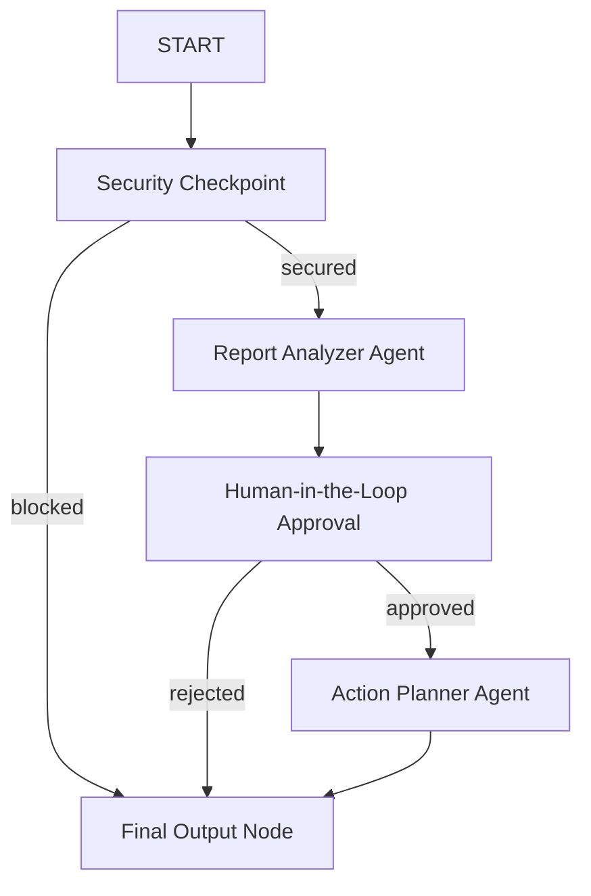

# Submission Writeup: AquaGuard Agent

## Problem Statement
Access to clean water is a fundamental human right, yet many communities globally suffer from sudden water quality drops due to infrastructure decay, agricultural runoff, or industrial contamination. Traditional reporting systems are slow, disconnected from civic volunteer networks, and fail to provide immediate, actionable safety guidance to affected citizens. AquaGuard Agent solves this by acting as an intelligent, secure, and immediate water quality monitor that links community reports directly to map logging and volunteer coordination.

## Solution Architecture
The application is built on a structured workflow graph containing specialized agents, a security checkpoint, and tools connected via the Model Context Protocol (MCP).

## Concepts Used
- **ADK 2.0 Workflows**: Graph-based flow with nodes and edges managed in [agent.py](aquaguard_agent/agent.py).
- **LlmAgent**: Used for specialized roles ([report_analyzer](aquaguard_agent/agent.py#L44-L57) and [action_planner](aquaguard_agent/agent.py#L59-L71)).
- **MCP Server**: Defined in [mcp_server.py](aquaguard_agent/mcp_server.py) using FastMCP.
- **Security Checkpoint**: Implemented as a node in [agent.py](aquaguard_agent/agent.py#L74-L123) protecting LLMs from injections and scrubbing PII.
- **Agents CLI**: Project structured with standard manifest and runner apps.

## Security Design
1. **PII Scrubbing**: Regex filters automatically scan user reports for email addresses and phone numbers, substituting them with redacted tags before LLM consumption to protect reporter privacy.
2. **Prompt Injection Protection**: Detects adversarial commands like "ignore previous instructions" or "system prompt override" in the input node, routing malicious payloads to an immediate block path.
3. **Structured Audit Logs**: Every classification and security event prints a structured JSON log containing status details and timestamps to `stderr` for non-repudiable audit trails.

## MCP Server Design
The FastMCP server exposes three domain-specific tools:
- `get_water_standards()`: Returns standard EPA safety thresholds (e.g., Lead max 0.015 mg/L). Wired to `ReportAnalyzer` to let it compare report measurements with safety standards.
- `log_hotspot()`: Appends a flagged contamination hotspot to a local JSON file (`hotspots.json`). Wired to `ActionPlanner`.
- `register_volunteer()`: Enrolls civic volunteers into a local JSON database (`volunteers.json`) for cleanup activities. Wired to `ActionPlanner`.

## HITL Flow
To prevent panic and coordinate efforts safely, high-severity reports (e.g. heavy metal detection or toxicity) are routed through a human approval step:
- The `human_approval` workflow node checks if severity is classified as `High`.
- If high, it yields `RequestInput`, halting execution and prompting the administrator to type `approve` or `reject` in the playground.
- This ensures that only verified severe incidents log hotspots or mobilize community volunteers.

## Demo Walkthrough
- **Scenario 1 (Low Severity)**: Citizen reports a muddy smell. Analyzer classifies it as `Low`. Action planner logs the hotspot and lists filter advice.
- **Scenario 2 (High Severity)**: Citizen reports Lead level is `0.05 mg/L` (exceeding safety limits). Analyzer classifies it as `High`. The workflow pauses. The admin approves the request. The action planner logs the severe hotspot and provides safety warnings.
- **Scenario 3 (Security Block)**: Malicious input tries to leak instructions. Security checkpoint blocks it immediately.

## Impact & Value Statement
AquaGuard empowers local citizen science by bridging the gap between reporting and mitigation. It provides instant EPA-grade guidance, maps contamination trends in real-time, and mobilizes volunteer clean-up efforts safely and securely.
